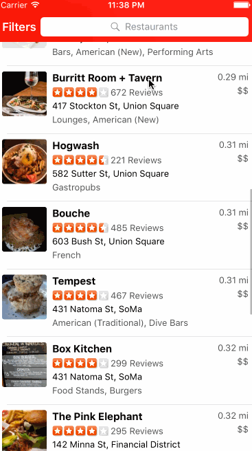

# Yelp Client
Codepath Week 2 Assignment

Time spent: ~10 - 12 hours

Completed stories:
* Search results page
  * Table rows should be dynamic height according to the content height.
  * Custom cells should have the proper Auto Layout constraints.
  * Search bar should be in the navigation bar
* Filter page
  * The filters you should actually have are: category, sort (best match, distance, highest rated), radius (meters), deals (on/off).
  * The filters table should be organized into sections as in the mock.
  * You can use the default UISwitch for on/off states. Implement a custom switch (optional)
  * Clicking on the "Search" button should dismiss the filters page and trigger the search w/ the new filter settings.
  * Categories should show a subset of the full list with a "See All" row to expand (optional)

TODO:
* Fix display bug for custom UISwitch